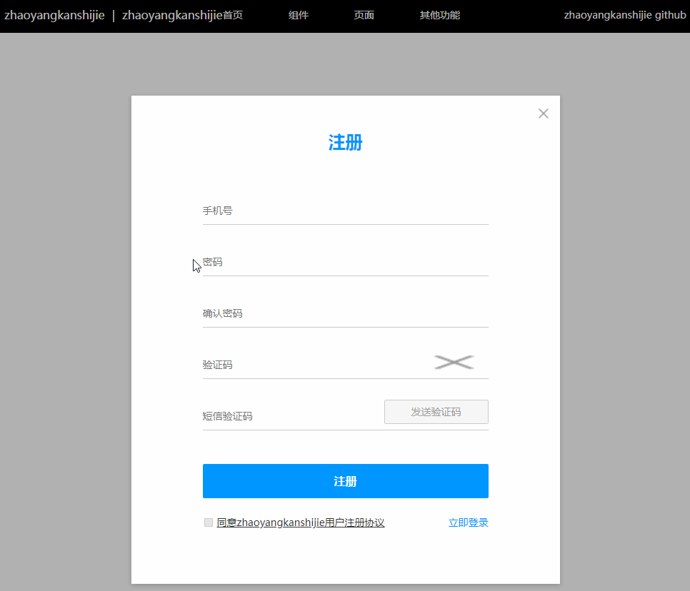
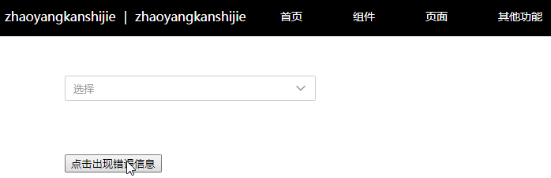

# Angular7Example

This project was generated with [Angular CLI](https://github.com/angular/angular-cli) version 7.3.4.

## Development server

Run `ng serve` for a dev server. Navigate to `http://localhost:4200/`. The app will automatically reload if you change any of the source files.

## Code scaffolding

Run `ng generate component component-name` to generate a new component. You can also use `ng generate directive|pipe|service|class|guard|interface|enum|module`.

## Build

Run `ng build` to build the project. The build artifacts will be stored in the `dist/` directory. Use the `--prod` flag for a production build.

## Running unit tests

Run `ng test` to execute the unit tests via [Karma](https://karma-runner.github.io).

## Running end-to-end tests

Run `ng e2e` to execute the end-to-end tests via [Protractor](http://www.protractortest.org/).

## Further help

To get more help on the Angular CLI use `ng help` or go check out the [Angular CLI README](https://github.com/angular/angular-cli/blob/master/README.md).


## 组件

### inputBox



1. 功能描述

inputBox组件由标题、可变类型输入框、错误提示三部分组成，适用于数据填写与校验，减少提交数据的复杂度。

2. 技术面
* 父子组件通信：@Input()、@Output()、new EventEmitter<String>()
* 双向绑定并去除空格：[ngModel]="val" (ngModelChange)="valtrim($event)"
* 自定义input：type、placeholder、name、maxlength、pattern、title、required、disabled、readOnly、blur、focus
* 生命周期
* 监听父组件值变化：ngOnChanges(changes: SimpleChanges): void
* 父组件调用子组件方法：#child、@ViewChild("phone") account: InputBoxComponent

3. 组件属性
* 标题：subtitle: String
* input type：inputType: String
* input name：inputName: String
* input value：inputValue: String
* input disabled：disable: Boolean
* input readonly：readOnly: Boolean
* input maxlength：len: Number
* input pattern：patternReg: String
* input title：validTitle: String
* input required 提示文字：required: String
* 数据校验规则 patternInfo: Array
    * 样例
    ```js
    patternInfo:{
      //校验顺序按书写顺序
      //符合此正则时报错
      {
        pattern: /1\d{10}/,
        info: '样例格式不正确'
      },
      //字符串相等报错
      {
        pattern: "123456",
        option: '=',
        info: '不能与123456相同，请重新输入'
      },
      //字符串不等报错
      {
        pattern: "123456",
        option: '!',//可不传option
        info: '与123456相同，请重新输入'
      },
      //输入长度大于指定数报错，可用len取代
      {
        pattern: 5,
        option: '>',
        info: '样例格式不正确'
      },
      //输入长度等于指定数报错
      {
        pattern: 5,
        option: '=',
        info: '样例格式不正确'
      },
      //输入长度小于指定数报错
      {
        pattern: 5,
        option: '<',//可不传option
        info: '样例格式不正确'
      },
      //直接报错
      {
        pattern: true,
        info: '样例格式不正确'
      },
      //不报错,密码判断相等或不等时使用,结合下方组件事件
      {
        pattern: false as any,
        info: '新密码不能与旧密码相同，请重新输入/两次密码不一致，请重新输入'
      }
    }
    ```

4. 组件事件
* beforeFocus：focus逻辑执行前emit的事件
* focused：focus逻辑执行后emit的事件
* beforeBlur：focus逻辑执行前emit的事件
    * 此处一般用作密码判断相等或不等：父组件可在此时同步其它组件数据，修改pattern为false的项
* blured：focus逻辑执行后emit的事件

5. 父组件可调用方法
* focusAction：focus逻辑（emit事件）
* blurAction：blur逻辑（emit事件、数据校验、可提交标志）
* getVal：获取input value
* getSubmitState：是否可提交，是否校验完全通过
* showServerInfo：显示服务器返回错误

### selectBox



1. 功能描述

selectBox组件模拟select-option，并添加了错误提示。

2. 技术面
* 自定义指令Directive
* 元素引用ElementRef
* 自定义事件HostListener

3. 组件属性
* 是否出现右侧勾选框：time : boolean
* 默认提示文字：defaultWord : String
* 默认报错：defaultHint : String
* 选项[{内容，是否选中}]：InitOption=[{detail:string,status:boolean}]

4. 父组件可调用方法
* getVal：获取当前选中值
* getSubmitStatus：获取提交状态
* showServerHint：显示服务器返回错误
* hideOption：隐藏选项

## 页面

### 待更新

## 其它功能

### 管道：带样式文本
页面显示
```js
public value : String = "Hello <span style=\"color: #0096FF;\">World</span>"

<p [innerHtml] = "value | myHtml"></p>
```
管道(需全局引用)
```js
import { Pipe, PipeTransform } from '@angular/core';
import { DomSanitizer } from "@angular/platform-browser";

@Pipe({
  name: "myHtml"
})

export class MyHtmlPipe implements PipeTransform {

  constructor (private sanitizer: DomSanitizer) {

  }
  
  transform(html) {
    return this.sanitizer.bypassSecurityTrustHtml(html);
  }

}
```

### 配置nginx
```txt
    server {
        listen       8083;
        server_name  localhost;
        
        location / {
            root   D:\wwwroot;
            try_files $uri $uri/ /index.html;
            index  index.html index.htm;
        }

        location /api {
            add_header 'Access-Control-Allow-Origin' '*';
            proxy_pass http://localhost:7675/api;
        }
        
        error_page   500 502 503 504  /50x.html;
        location = /50x.html {
            root   html;
        }
    }
```

### 引入组件axios cookie

```js
import { CookieService } from 'ngx-cookie-service';
import axios from 'axios';

providers: [CookieService]
```