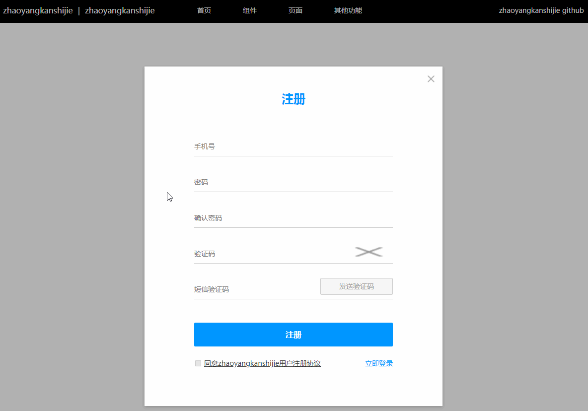
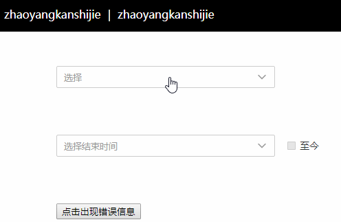
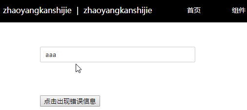
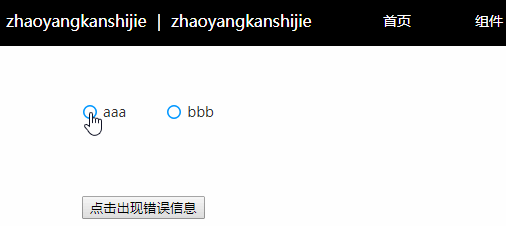
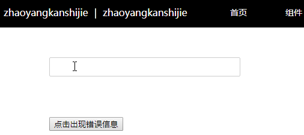
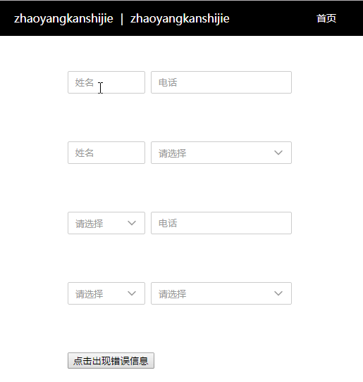
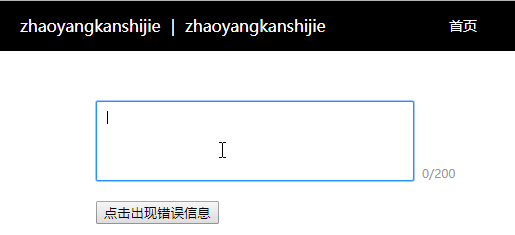
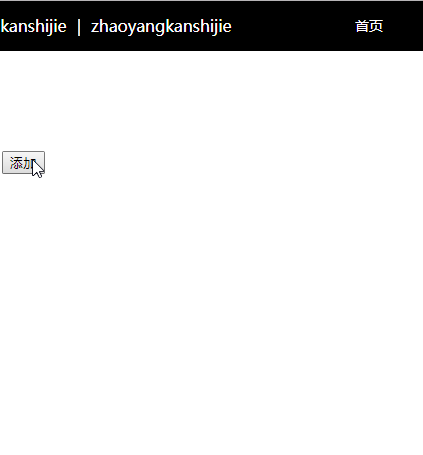
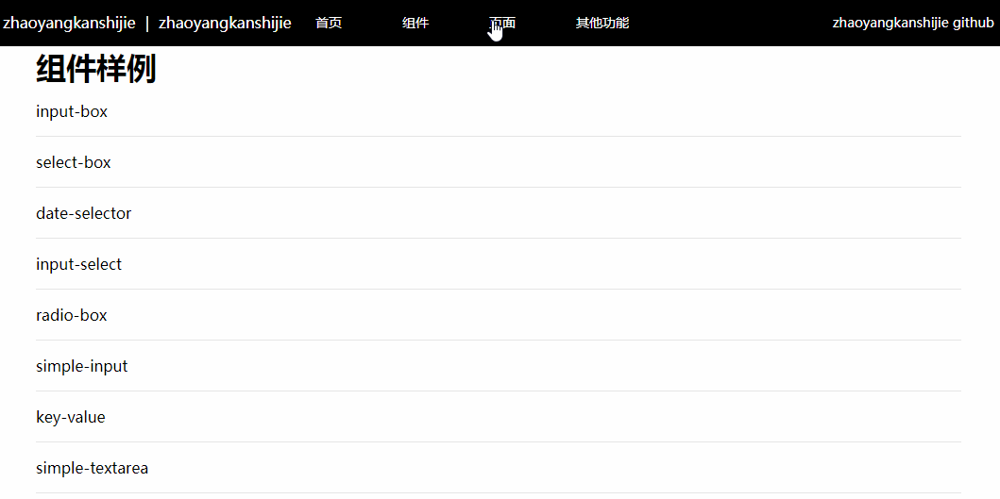

# Angular7Example

This project was generated with [Angular CLI](https://github.com/angular/angular-cli) version 7.3.4.

## Development server

Run `ng serve` for a dev server. Navigate to `http://localhost:4200/`. The app will automatically reload if you change any of the source files.

## Code scaffolding

Run `ng generate component component-name` to generate a new component. You can also use `ng generate directive|pipe|service|class|guard|interface|enum|module`.

## Build

Run `ng build` to build the project. The build artifacts will be stored in the `dist/` directory. Use the `--prod` flag for a production build.

## Running unit tests

Run `ng test` to execute the unit tests via [Karma](https://karma-runner.github.io).

## Running end-to-end tests

Run `ng e2e` to execute the end-to-end tests via [Protractor](http://www.protractortest.org/).

## Further help

To get more help on the Angular CLI use `ng help` or go check out the [Angular CLI README](https://github.com/angular/angular-cli/blob/master/README.md).


## 组件

### inputBox



1. 功能描述

inputBox组件由标题、可变类型输入框、错误提示三部分组成，适用于数据填写与校验，减少提交数据的复杂度。

2. 技术面
* 父子组件通信：@Input()、@Output()、new EventEmitter<String>()
* 双向绑定并去除空格：[ngModel]="val" (ngModelChange)="valtrim($event)"
* 自定义input：type、placeholder、name、maxlength、pattern、title、required、disabled、readOnly、blur、focus
* 生命周期
* 监听父组件值变化：ngOnChanges(changes: SimpleChanges): void
* 父组件调用子组件方法：#child、@ViewChild("phone") account: InputBoxComponent

3. 组件属性
* 标题：subtitle: String
* input type：inputType: String
* input name：inputName: String
* input value：inputValue: String
* input disabled：disable: Boolean
* input readonly：readOnly: Boolean
* input maxlength：len: Number
* input pattern：patternReg: String
* input title：validTitle: String
* input required 提示文字：required: String
* 数据校验规则 patternInfo: Array
    * 样例
    ```js
    patternInfo:{
      //校验顺序按书写顺序
      //符合此正则时报错
      {
        pattern: /1\d{10}/,
        info: '样例格式不正确'
      },
      //字符串相等报错
      {
        pattern: "123456",
        option: '=',
        info: '不能与123456相同，请重新输入'
      },
      //字符串不等报错
      {
        pattern: "123456",
        option: '!',//可不传option
        info: '与123456相同，请重新输入'
      },
      //输入长度大于指定数报错，可用len取代
      {
        pattern: 5,
        option: '>',
        info: '样例格式不正确'
      },
      //输入长度等于指定数报错
      {
        pattern: 5,
        option: '=',
        info: '样例格式不正确'
      },
      //输入长度小于指定数报错
      {
        pattern: 5,
        option: '<',//可不传option
        info: '样例格式不正确'
      },
      //直接报错
      {
        pattern: true,
        info: '样例格式不正确'
      },
      //不报错,密码判断相等或不等时使用,结合下方组件事件
      {
        pattern: false as any,
        info: '新密码不能与旧密码相同，请重新输入/两次密码不一致，请重新输入'
      }
    }
    ```

4. 组件事件
* beforeFocus：focus逻辑执行前emit的事件
* focused：focus逻辑执行后emit的事件
* beforeBlur：focus逻辑执行前emit的事件
    * 此处一般用作密码判断相等或不等：父组件可在此时同步其它组件数据，修改pattern为false的项
* blured：focus逻辑执行后emit的事件

5. 父组件可调用方法
* focusAction：focus逻辑（emit事件）
* blurAction：blur逻辑（emit事件、数据校验、可提交标志）
* getVal：获取input value
* getSubmitStatus：是否可提交，是否校验完全通过
* showServerInfo：显示服务器返回错误

### selectBox



1. 功能描述

selectBox组件模拟select-option，并添加了错误提示。

2. 技术面
* 自定义指令Directive
* 元素引用ElementRef
* 自定义事件HostListener

3. 组件属性
* 是否出现右侧勾选框：time : boolean
* 默认提示文字：defaultWord : String
* 默认报错：defaultHint : String
* 选项[{内容，是否选中}]：InitOption=[{detail:string,status:boolean}]

4. 父组件可调用方法
* getVal：获取当前选中值
* setVal：设置值
* getSubmitStatus：获取提交状态
* showServerHint：显示服务器返回错误
* getHint：获取提示文字
* hideOption：隐藏选项

### inputSelect



1. 功能描述

inputSelect组件用于input输入时带提示，类似自动填充autocomplete，并添加了错误提示。

2. 技术面
* 自定义指令Directive
* 元素引用ElementRef
* 自定义input

3. 组件属性
* 默认提示文字：defaultWord : String
* 默认值：defaultValue : String
* 默认报错：defaultHint : String
* 选项[{内容，是否选中}]：InitOption=[{detail:string,status:boolean}]

4. 父组件可调用方法
* getVal：获取当前选中值
* setVal：设置值
* getSubmitStatus：获取提交状态
* showServerInfo：显示服务器返回错误
* getHint：获取提示文字

### radioBox



1. 功能描述

radioBox组件模拟input radio功能，能自定义样式，并添加了错误提示。

2. 技术面
* 自定义input

3. 组件属性
* 默认选项：defaultIndex : number
* 默认报错：defaultHint : String
* 选项[{内容，是否选中}]：InitOption=[{detail:string,status:boolean}]

4. 父组件可调用方法
* getVal：获取当前选中值
* setVal：设置值
* getSubmitStatus：获取提交状态
* showServerInfo：显示服务器返回错误
* getHint：获取提示文字

### simpleInput



1. 功能描述

simpleInput组件简化inputBox功能，提供简便的输入与错误提示。额外添加输入提示。

2. 技术面
* 自定义input

3. 组件属性
* 默认提示文字：defaultWord : String
* 默认值：defaultValue : String
* 默认报错：defaultHint : String
* 数据校验规则 patternInfo: Array 同inputBox
* 提示数组 optionList: Array 
  ```js
    [
      {
        Name: "",
        ...
      },
      ...
    ]
  ```

4. 父组件可调用方法
* getVal：获取当前选中值
* setVal：设置值
* getSubmitStatus：获取提交状态
* showServerInfo：显示服务器返回错误
* getHint：获取提示文字

### dateSelector


1. 功能描述

dateSelector组件模拟input date功能，提供自定义样式与错误提示。

2. 技术面
* 自定义input
* js date操作
* css js 梯级样式

3. 组件属性
* 是否选择勾选框值：toNow : String
* 起始年份：startYear : number
* 结束年份：startYear : number
* 勾选框值：defaultCheckboxValue : String
* 默认值：defaultValue : String
* 默认报错：defaultHint : String
* 悬停在年份或月份?ms展示下一级：hoverTime : number

4. 父组件可调用方法
* getVal：获取当前选中值
* setVal：设置值
* getSubmitStatus：获取提交状态
* showServerInfo：显示服务器返回错误
* getHint：获取提示文字

### keyValue



1. 功能描述

keyValue组件用于填写键值的功能，输出值为(key)value，提供自定义样式与错误提示。

2. 技术面
* input box与select box结合体，可参见之前的组件

3. 组件属性
* 键类型：keyType : String
* 值类型：valueType : String
* 键对象：keyObject : {}
* 值对象：valueObject : {}
* 键是否必填：defaultKeyRequired : Boolean
* 值是否必填：defaultValueRequired : Boolean
* 默认值：defaultValue : String

4. 父组件可调用方法
* getVal：获取当前选中值
* setVal：设置值
* getSubmitStatus：获取提交状态
* showServerInfo：显示服务器返回错误
* getHint：获取提示文字

### simpleTextarea



1. 功能描述

simpleTextarea组件拓展textarea功能，能额外统计和限制字数，提供自定义样式与错误提示。

2. 技术面
* 自定义textarea

3. 组件属性
* 初始值：inputValue : String
* 提示文字：placeholder : String
* 字数限制：limit : number
* 是否必填：require : Boolean
* 默认值：defaultValue : String

4. 父组件可调用方法
* getVal：获取当前选中值
* setVal：设置值
* getSubmitStatus：获取提交状态
* showServerInfo：显示服务器返回错误
* getHint：获取提示文字

## 页面

### 组件增删改查



1. 技术面
* for if配合使用
* ViewChildren
* ChangeDetectorRef
* 查找data与ViewChildren对应函数indexOfN
* 对象深克隆deepClone

## 其它功能

### 管道：带样式文本
页面显示
```js
public value : String = "Hello <span style=\"color: #0096FF;\">World</span>"

<p [innerHtml] = "value | myHtml"></p>
```
管道(需全局引用)
```js
import { Pipe, PipeTransform } from '@angular/core';
import { DomSanitizer } from "@angular/platform-browser";

@Pipe({
  name: "myHtml"
})

export class MyHtmlPipe implements PipeTransform {

  constructor (private sanitizer: DomSanitizer) {

  }
  
  transform(html) {
    return this.sanitizer.bypassSecurityTrustHtml(html);
  }

}
```

### 服务
service
```ts
import { Injectable } from '@angular/core';
import { Subject, Subscription, Observable } from 'rxjs';

@Injectable({
  providedIn: 'root'
})
export class StorageService {
  private subject = new Subject<any>();
  
  sendMessage(message:string){
    this.subject.next({message:message});
  }

  clearMessage(){
    this.subject.next();
  }

  getMessage():Observable<any> {
    return this.subject.asObservable();
  }

  constructor(){}

}
```

componentA
```ts
import { Component, OnInit } from '@angular/core';
import { StorageService } from '../../services/storage.service';

@Component({
  selector: 'service',
  templateUrl: './service.component.html',
  styleUrls: ['./service.component.scss']
})
export class ServiceComponent implements OnInit {

  constructor(private storage: StorageService) { }

  ngOnInit() {
    this.storage.sendMessage('errorLogout');
  }

}
```

componentB
```ts
import { StorageService } from '../../services/storage.service';
import { Subject, Subscription, Observable } from 'rxjs';

...

constructor(private storage: StorageService ) { }

ngAfterViewInit() {
    this.subscription = this.storage.getMessage().subscribe(
      msg => {
        console.log(msg);
        // do else in this component
      });
    }

...
```

### 配置nginx
```txt
    server {
        listen       8083;
        server_name  localhost;
        
        location / {
            root   D:\wwwroot;
            try_files $uri $uri/ /index.html;
            index  index.html index.htm;
        }

        location /api {
            add_header 'Access-Control-Allow-Origin' '*';
            proxy_pass http://localhost:7675/api;
        }
        
        error_page   500 502 503 504  /50x.html;
        location = /50x.html {
            root   html;
        }
    }
```

### 引入组件axios cookie

```js
import { CookieService } from 'ngx-cookie-service';
import axios from 'axios';

providers: [CookieService]
```

### 页面过渡动画



引入包@angular/animations`

home.module.ts全局引用
```js
import { NgModule } from '@angular/core';
import { BrowserModule } from '@angular/platform-browser';
import { BrowserAnimationsModule } from '@angular/platform-browser/animations';

@NgModule({
  imports: [ BrowserModule, BrowserAnimationsModule, ... ],
  declarations: [  ... ],
  bootstrap: [ ... ]
})
```

router.animations.ts动画文件
```txt
状态切换为:":enter"和":leave"
group是动画并行同步
```

home.component.html主页面
```html
<!-- [@动画名称]="状态改变函数" -->
<div id="app" [@routerTransition]="getState(o)">
    <router-outlet #o="outlet"></router-outlet>
</div>
<!-- #o="outlet" 中outlet可获取底层RouterOutlet-->
```

home.component.ts
```js
import { routerTransition } from './router.animations';
@Component({
  selector: 'app-root',
  templateUrl: './home.component.html',
  styleUrls: ['./home.component.scss'],
  animations: [routerTransition]
})
...
  getState(outlet) {
    return outlet.activatedRouteData.state;
  }
```

app-routing.module.ts路由配置改变的参数
```js
{
  path: 'index',
  component: IndexComponent,
  data: { state: 'index' }
}
...
```

### 路由守卫
auth.guard.ts
```ts
import { Injectable } from '@angular/core';
import { CanActivate, ActivatedRouteSnapshot, RouterStateSnapshot, Router } from '@angular/router';
import { StorageService } from '../services/storage.service';

@Injectable({
  providedIn: 'root'
})
export class AuthGuard implements CanActivate {

    constructor(private router: Router, private storage: StorageService) {}

    // 路由守卫
    canActivate(next: ActivatedRouteSnapshot, state: RouterStateSnapshot): boolean {
        //console.log(next,state)
        if (navigator.userAgent.indexOf('Mobile') >-1){
            window.location.href = 'https://www.baidu.com';
        }
        this.storage.sendMessage({message: 'sendMessage', goToURL: state.url});
        return true;
    }
}
```
app-routing.module.ts
```ts
const routes: Routes = [
  {
    path: '',
    component: IndexComponent,
    canActivate: [AuthGuard]
  }
]
```
storage.service.ts
```ts
import { Injectable } from '@angular/core';
import { Subject, Subscription, Observable } from 'rxjs';

@Injectable({
  providedIn: 'root'
})
export class StorageService {
  private subject = new Subject<any>();
  
  sendMessage(message){
    this.subject.next(message);
  }

  clearMessage(){
    this.subject.next();
  }

  getMessage():Observable<any> {
    return this.subject.asObservable();
  }

  constructor(){}
}
```
某页面
```ts
ngAfterViewInit() {
    this.subscription = this.storage.getMessage().subscribe(
      msg => {
        console.log(msg);
      }
    )
```